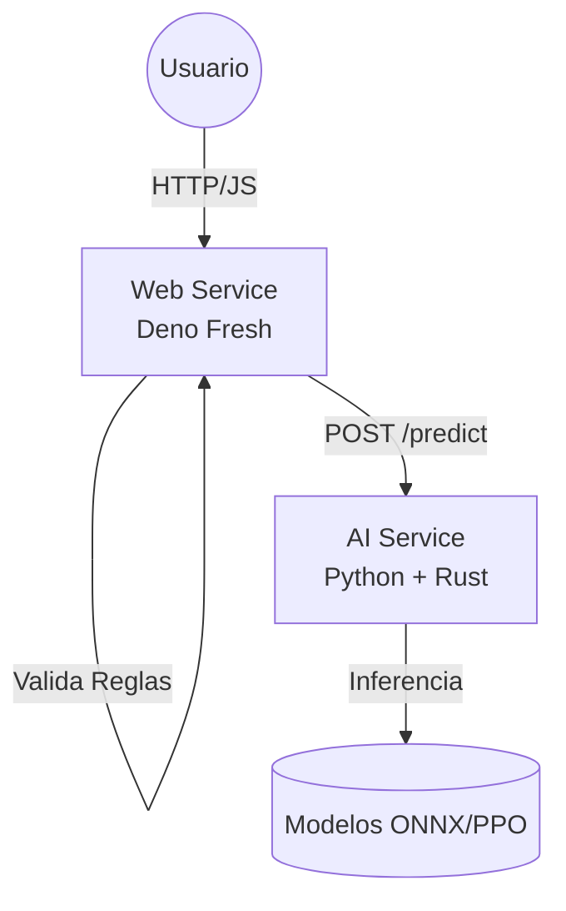

# ⚛️ Chain Reaction AI: Investigación en Entornos de Alta Volatilidad


Este repositorio contiene el código fuente, benchmarks y modelos entrenados para el estudio comparativo de algoritmos de **Inteligencia Artificial (Reinforcement Learning vs Minimax)** aplicados al juego "Chain Reaction" (Color Wars).

El proyecto implementa una arquitectura de **Sistemas Distribuidos Híbridos**, combinando una interfaz web moderna y ligera con un motor de cálculo de alto rendimiento.

## 📋 Tabla de Contenidos
- [Arquitectura del Sistema](#-arquitectura-del-sistema)
- [Tecnologías Utilizadas](#-tecnologías-utilizadas)
- [Estructura del Proyecto](#-estructura-del-proyecto)
- [Requisitos Previos](#-requisitos-previos)
- [Instalación y Ejecución](#-instalación-y-ejecución)
- [Metodología de Investigación](#-metodología-de-investigación)
- [Gestión de Modelos (DVC)](#-gestión-de-modelos-dvc)

---

## 🏛 Arquitectura del Sistema

El sistema sigue un patrón de **Microservicios** orquestados, separando la lógica de presentación de la lógica computacional intensiva.

1.  **Frontend & Game Logic (Web Service):**
    *   Desarrollado en **Deno Fresh** utilizando **Islands Architecture**.
    *   Gestiona la interacción con el usuario, validación de reglas en tiempo real y persistencia ligera (Deno KV).
    *   Actúa como "fuente de verdad" para el estado del juego.

2.  **AI Engine (Computation Service):**
    *   Desarrollado en **Python** siguiendo una **Arquitectura Hexagonal**.
    *   Expone una API REST (FastAPI) para inferencia de movimientos.
    *   **Núcleo Híbrido:** Implementa motores intercambiables (Python puro vs. Bindings de **Rust** con Bitboards) para maximizar la eficiencia de memoria y velocidad de búsqueda.



---

## 🛠 Tecnologías Utilizadas

### Fullstack Web
*    **Runtime:** Deno (TypeScript nativo).
*    **Framework:** Fresh (Preact Signals, Islands).
*    **Orquestación:** Podman Compose (Rootless containers).

### Inteligencia Artificial & High Performance Computing
*    **Orquestación AI:** FastAPI, PyTorch.
*    **Core Engine:** Implementación optimizada con Bitboards (via PyO3).
*   **Algoritmos:** Stable Baselines 3 (PPO/DQN), Minimax con Alpha-Beta Pruning.
*    **MLOps:** Data Version Control para modelos binarios.

---

## 📂 Estructura del Proyecto

El repositorio opera como un **Monorepo**:

```bash
/
├── compose.yml              # Orquestación de servicios (Podman/Docker)
├── README.md                # Documentación principal
├── .dvc/                    # Configuración de Data Version Control
│
├── /ai-service              # [MICROSERVICIO PYTHON]
│   ├── /src
│   │   ├── /core            # Interfaces (Ports) y Lógica de Negocio
│   │   ├── /engines         # Implementaciones (Naive Python, Rust Bindings)
│   │   └── /agents          # Estrategias (Minimax, PPO, Random)
│   ├── /models              # Archivos binarios (.zip, .onnx) trackeados por DVC
│   ├── main.py              # Entrypoint FastAPI
│   └── Dockerfile
│
└── /web-service             # [MICROSERVICIO DENO]
    ├── /islands             # Componentes interactivos (Game Board)
    ├── /routes              # API y Vistas
    ├── /utils               # Lógica de juego compartida (Reglas TS)
    ├── deno.json
    └── Dockerfile
```

---

## 📋 Requisitos Previos

*   **Podman** (con `podman-compose`) o **Docker Desktop**.
*   **Git**.
*   (Opcional para desarrollo local): Deno 1.x, Python 3.10+, Rust (Cargo).

---

## 🚀 Instalación y Ejecución

Para levantar todo el entorno (Juego + IA) en modo desarrollo:

1.  **Clonar el repositorio:**
    ```bash
    git clone [https://github.com/tu-usuario/color-wars-research.git](https://github.com/V-enekoder/ColorWars.git)
    cd ColorWars
    ```

2.  **Descargar modelos entrenados (DVC):**
    ```bash
    # Requiere acceso al almacenamiento remoto configurado
    dvc pull
    ```

3.  **Iniciar servicios con Podman:**
    ```bash
    podman-compose up --build
    ```

4.  **Acceder:**
    *   🎮 **Juego Web:** [http://localhost:3000](http://localhost:5173)
    *   🧠 **API Docs (Swagger):** [http://localhost:8000/docs](http://localhost:8000/docs)

---

## 🔬 Metodología de Investigación

Este proyecto busca responder a la pregunta: *¿Es más eficiente la intuición aprendida (Deep RL) que la fuerza bruta optimizada (Minimax) en juegos de reacción en cadena?*

### Benchmarks Implementados:
1.  **Eficiencia de Memoria:** Comparativa de uso de RAM entre implementaciones de Hash Maps en Python vs Rust.
2.  **Profundidad de Búsqueda:** Análisis del impacto de Bitboards en el número de nodos evaluados por segundo (NPS).
3.  **Calidad de Juego:** Torneos automatizados (Arena) entre agentes PPO, DQN y Minimax con distintos límites de recursos.

---

## 🤖 Gestión de Modelos (DVC)

Los archivos de modelos entrenados (`.zip`, `.onnx`) no se guardan en Git. Se gestionan con DVC.

*   Para trackear un nuevo modelo:
    ```bash
    dvc add ai-service/models/best_model.onnx
    git add ai-service/models/best_model.onnx.dvc
    git commit -m "Update: Nuevo modelo entrenado con 5M pasos"
    dvc push
    ```

---
