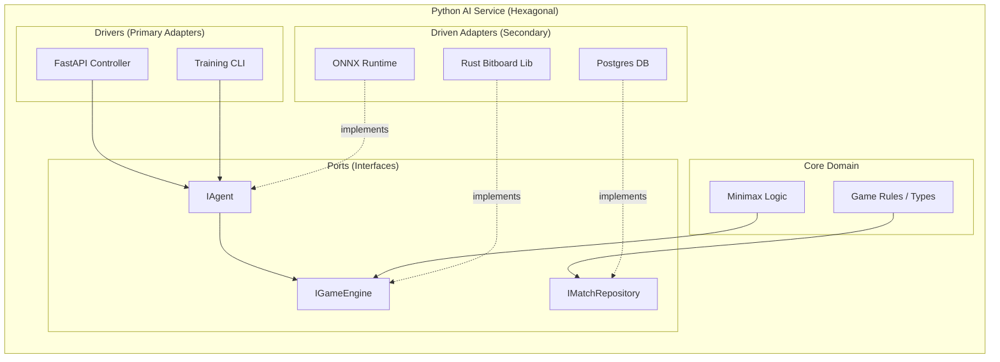

```mermaid
graph TD
    subgraph "Python AI Service (Hexagonal)"
        direction TB
        
        subgraph "Drivers (Primary Adapters)"
            API[FastAPI Controller]
            CLI[Training CLI]
        end

        subgraph "Ports (Interfaces)"
            IGame[IGameEngine]
            IAgent[IAgent]
            IRepo[IMatchRepository]
        end

        subgraph "Core Domain"
            Logic[Game Rules / Types]
            Minimax[Minimax Logic]
        end

        subgraph "Driven Adapters (Secondary)"
            Rust[Rust Bitboard Lib]
            ONNX[ONNX Runtime]
            PG[Postgres DB]
        end

        %% Conexiones Estándar
        API --> IAgent
        CLI --> IAgent
        
        IAgent --> IGame
        Minimax --> IGame
        Logic --> IRepo

        %% Conexiones de Implementación (Corregidas)
        %% Usamos -.-> para denotar "implementa" (línea punteada) y |texto| para la etiqueta
        Rust -.->|implements| IGame
        ONNX -.->|implements| IAgent
        PG -.->|implements| IRepo
    end
```
